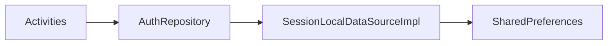

# Architecture notes

## Refactor alignment (CustomApplication patterns)

We mirrored the reference app’s **package shape** (`app`, `screens`, `data`, `utils`) and **navigation style** (explicit `Activity` + `Intent`). Renvest keeps a richer **Material 3** UI and edge-to-edge behavior rather than downgrading to plain `EditText`/`Button` screens.

## Data flow (auth)

- **`AuthRepository`** is the entry point for screens (`authRepository()` from `Context`).
- **`SessionLocalDataSourceImpl`** owns preference keys and read/write semantics (formerly a single `SessionStore` object).
- **`RenvestResult`** wraps outcomes for mutations (`signIn`, `signUp`, `clearSession`) so network or storage failures can be surfaced consistently later.

## Remote API

`data.remote.ApiService` is an empty placeholder. When backend contracts exist, implement the interface with Retrofit/Ktor and have repositories call into it, mapping errors to `RenvestResult.Err.Network` or `Validation`.

## Feature stubs

`screens.loyalty`, `screens.promotions`, and `screens.customers` host placeholder activities using `activity_feature_stub.xml`. The dashboard wires:

- **Manage loyalty** and the **loyalty points** metric card → `LoyaltyActivity`
- **Customers** metric card → `CustomersActivity`
- **Promotions** metric card → `PromotionsActivity`

Replace stubs with real flows without renaming the package buckets if possible.

## Testing

Instrumented tests live under `app/src/androidTest/java/com/business/renvest/`. After large package moves, keep the test package aligned with the app id (`com.business.renvest`).
