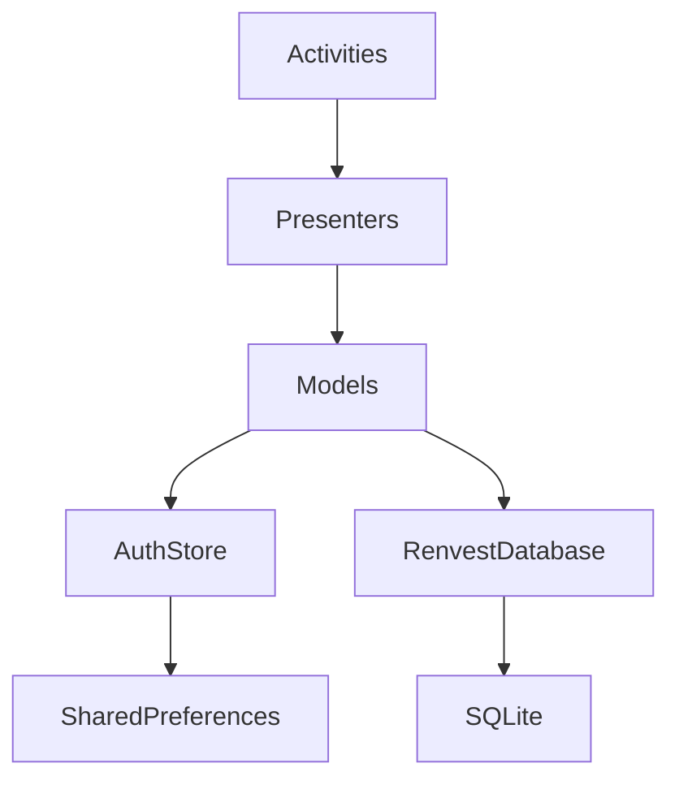

# Architecture notes

## Refactor alignment (CustomApplication patterns)

We mirrored the reference app’s **package shape** (`app`, `screens`, `data`, `utils`) and **navigation style** (explicit `Activity` + `Intent`). Renvest keeps a richer **Material 3** UI and edge-to-edge behavior rather than downgrading to plain `EditText`/`Button` screens.

## Data flow (local MVP)

- **`AuthStore`** is the shared session store (`authStore()` from `Context`): login flag, business name, email. It stays on **SharedPreferences** (`renvest_session`); presenters do not talk to prefs directly—they go through models.
- **`RenvestDatabase`** (Room, under `com.business.renvest.data.local`) is the **local source of truth** for feature rows: loyalty reminders, promotions, customers, and activity events. Access it with `renvestDb()` from `Context` (singleton on `RenvestApp`).
- **Screen models** wrap **`AuthStore`** and/or **`RenvestDatabase`** so presenters stay thin. Examples: `DashboardModel` (greeting + `LocalDataCounts`), `PromotionsModel` (list + hero counts), `LoyaltyModel` (reminder CRUD), `CustomersModel`, `ActivityFeedModel`, `ProfileModel`, `AiEngagementAdvisorModel` (local counts only for copy—no remote AI).
- **`RenvestResult`** wraps outcomes for mutations (`signIn`, `signUp`, `clearSession`). Room writes today are direct DAO calls from models; map failures to UI messaging if you add transactional wrappers later. Use `notifyErrorIfNotOk` where `RenvestResult` is returned.

### MVP tradeoffs (explicit)

- **`allowMainThreadQueries()`** is enabled so existing synchronous presenters can query Room on the UI thread for small datasets. Remove this when you introduce background dispatching.
- **`fallbackToDestructiveMigration()`** is enabled until the schema stabilizes; do not rely on it once real user data must survive upgrades.

## Remote API

Not implemented yet. When backend contracts exist, add an HTTP client (e.g. Retrofit or Ktor) under `data`, keep Room as an offline cache if needed, and map transport errors to `RenvestResult.Err.Network` or `RenvestResult.Err.Validation`.

## Feature completeness

- **Loyalty reminders**: persisted in Room; add/remove flows write SQLite.
- **Promotions / customers / activity lists**: read from Room; **empty states** when there are zero rows. “New promo / add customer / log activity” actions may still toast **coming soon** until those write paths exist.
- **Dashboard / profile / promos hero metrics**: numeric cells reflect **real row counts** or neutral placeholders (e.g. revenue and ratings are **not** invented—strings like “Not recorded in app yet”).
- **AI Engagement Advisor**: **no remote model**. Copy is driven only by `AuthStore` identity plus **local row counts**; when there is no local data, the screen explains that honestly.

## Lists (RecyclerView / ListView)

- **Promotions**: `RecyclerView` + `PromotionsAdapter`; data from `PromotionDao`; empty banner when the list is empty.
- **Customers / activity feed**: `RecyclerView` + small row layouts in `res-ui/layout`; data from `CustomerDao` / `ActivityEventDao`.
- **Loyalty**: `ListView` + `ListView.emptyView` when there are no reminders.

## Testing

Instrumented tests live under `app/src/androidTest/java/com/business/renvest/`. After large package moves, keep the test package aligned with the app id (`com.business.renvest`).
