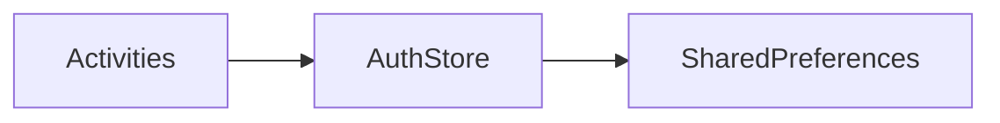

# Architecture notes

## Refactor alignment (CustomApplication patterns)

We mirrored the reference app’s **package shape** (`app`, `screens`, `data`, `utils`) and **navigation style** (explicit `Activity` + `Intent`). Renvest keeps a richer **Material 3** UI and edge-to-edge behavior rather than downgrading to plain `EditText`/`Button` screens.

## Data flow (auth)

- **`AuthStore`** is the shared data class used by screens (`authStore()` from `Context`).
- **`AuthStore`** reads and writes directly against SharedPreferences (`renvest_session`); this keeps the MVP data layer simple for the current scope.
- **`RenvestResult`** wraps outcomes for mutations (`signIn`, `signUp`, `clearSession`). Today mutations return `Ok` for normal prefs writes; `Err.Storage` remains in the type for parity if you add disk-heavy or transactional storage later. Use `notifyErrorIfNotOk` in the UI when handling errors consistently.

## Remote API

Not implemented yet. When backend contracts exist, add an HTTP client (e.g. Retrofit or Ktor), call it from `AuthStore` or split the data layer again if the app actually needs local and remote implementations, then map transport or API errors to `RenvestResult.Err.Network` or `RenvestResult.Err.Validation`.

## Feature stubs

Several flows are still static or “coming soon” UI. `LoyaltyActivity` uses `activity_feature_stub.xml`; dashboard and bottom navigation link customers, promotions, activity feed, and related screens with richer layouts. Replace placeholder behavior with real data without renaming package buckets when possible.

## Testing

Instrumented tests live under `app/src/androidTest/java/com/business/renvest/`. After large package moves, keep the test package aligned with the app id (`com.business.renvest`).
